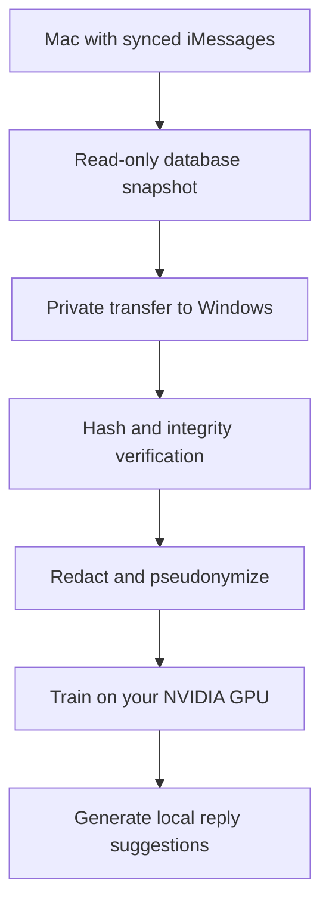

# Texts to Transformer for Windows

### Train a tiny, private language model on your iMessage history with an NVIDIA PC

[](https://www.microsoft.com/windows)
[](https://www.python.org/)
[](https://pytorch.org/)
[](LICENSE)

Apple Silicon should not be the only comfortable way to experiment with a personal text model.
This project brings the excellent
[texts-to-transformer](https://github.com/Doriandarko/texts-to-transformer) idea to Windows PCs with
NVIDIA graphics cards.

If you have never trained a model before, you are welcome here. You do not need to understand neural
networks, CUDA, tokenizers, or databases before you begin. The walkthrough explains each step, what
you should see, and what to do if something goes wrong.

> [!IMPORTANT]
> You need temporary access to a Mac where your iMessages are synced. Apple does not provide the
> Messages database to Windows. The Mac safely exports the data once; your Windows PC does all the
> processing and model training afterward.

## What does it make?

The result is a small local model that learns patterns in the way you reply: sentence length,
punctuation, slang, casing, emoji, and familiar conversational rhythms. Incoming messages are used
as context, while training loss is applied only to messages you sent.

It is a style model, not a replacement for ChatGPT. It will not reliably reason, perform research,
or know current facts. Its charm is much narrower: it tries to sound a little like you.

Nothing is sent automatically. The final `chat` command only prints reply suggestions in your
terminal.

## How it works



Attachments are not transferred. The live Messages database is never modified. Your dataset and
model stay on your own machines.

## Before you start

You will need:

- A 64-bit Windows 10 or Windows 11 PC
- An NVIDIA graphics card with a current driver
- 16 GB of system memory recommended
- About 10 GB of free disk space
- Temporary access to a Mac containing your synced iMessage history
- A USB drive or another private way to move the snapshot from Mac to Windows

An RTX 4070 Super is comfortably supported. Other recent CUDA-capable NVIDIA cards should work too.
CPU mode is available for tests, but useful training is intended for an NVIDIA GPU.

## Choose your guide

**New to this?** Start with the friendly, click-by-click
[Windows walkthrough](docs/WINDOWS_WALKTHROUGH.md). It begins with downloading the project and
finishes with your first generated reply.

**Already comfortable with PowerShell?** Follow the condensed quick start below.

**Want to understand the safety model first?** Read [Privacy and safety](docs/privacy.md).

## Quick start

### 1. Prepare the Windows PC

Extract this repository somewhere private, such as `Documents\texts-to-transformer-windows`. Avoid
putting it inside a public GitHub checkout, OneDrive, Dropbox, or a shared folder once private data
has been imported.

Install [`uv`](https://docs.astral.sh/uv/getting-started/installation/) if you do not already have
it. Then open PowerShell inside the project folder:

```powershell
Set-ExecutionPolicy -Scope Process Bypass
.\setup_windows.ps1
```

At the end, the doctor report should say:

```text
"cuda_available": true
"safe_to_train_on_gpu": true
```

It should also show the name of your NVIDIA GPU. If it does not, visit
[Troubleshooting](docs/troubleshooting.md#cuda_available-is-false-on-windows).

### 2. Export the iMessage snapshot on the Mac

Copy `tools/export_imessage_snapshot.py` to the Mac. Give Terminal Full Disk Access in:

```text
System Settings > Privacy & Security > Full Disk Access
```

Completely restart Terminal, open the folder containing the script, and run:

```bash
python3 export_imessage_snapshot.py
```

The script creates `imessage-snapshot` on the Mac desktop. It contains `chat.db` and
`manifest.json`. Transfer that entire folder privately to the PC.

For screenshots-in-words and common Mac permission problems, see the
[Mac export guide](docs/MAC_EXPORT.md).

### 3. Verify and import on Windows

Replace the example drive and folder with the real location of your transferred snapshot:

```powershell
uv run imessage-cuda import-snapshot `
  --database "D:\imessage-snapshot\chat.db" `
  --manifest "D:\imessage-snapshot\manifest.json"
```

Windows verifies both the SHA-256 fingerprint and SQLite integrity before accepting the file.

### 4. Prepare the private dataset

```powershell
uv run imessage-cuda prepare --config configs/data.yaml
uv run imessage-cuda privacy-audit
```

Only continue when the privacy audit reports `"passed": true`.

### 5. Train the tokenizer and count your data

```powershell
uv run imessage-cuda train-tokenizer `
  --train work/splits/train.jsonl `
  --output outputs/tokenizer `
  --vocab-size 4096

uv run imessage-cuda corpus-stats `
  --splits work/splits `
  --tokenizer outputs/tokenizer `
  --output work/tokens
```

The project requires at least one million training tokens for a normal run. This guard exists
because very small histories are more likely to be memorized than meaningfully modeled.

### 6. Train on the NVIDIA GPU

Most histories will select the small model:

```powershell
uv run imessage-cuda train `
  --config configs/model-1m.yaml `
  --data work/tokens `
  --tokenizer outputs/tokenizer `
  --output outputs/runs/my-model `
  --device cuda
```

Training prints safe aggregate progress such as loss, speed, and GPU memory. It never prints message
text. If `work/reports/model-selection.json` selects `model-7m`, use `configs/model-7m.yaml` instead.

### 7. Evaluate, export, and say hello

```powershell
uv run imessage-cuda evaluate `
  --checkpoint outputs/runs/my-model/best `
  --data work/tokens `
  --output outputs/evaluation.json

uv run imessage-cuda export `
  --checkpoint outputs/runs/my-model/best `
  --metrics outputs/evaluation.json `
  --output outputs/final

uv run imessage-cuda chat --model outputs/final
```

You will see an `other:` prompt. Type a pretend incoming message, press Enter, and the model will
print a suggested `me:` reply. Type `/quit` when you are finished.

## What stays private?

The following folders and files must never be committed, uploaded, attached to an issue, or shared:

```text
work/
outputs/
chat.db
manifest.json
*.safetensors
*.npy
```

They are blocked by `.gitignore`, but Git ignore rules are a safety net, not encryption. Use
BitLocker on Windows and FileVault on the Mac. Delete extra copies from portable media after the
verified import succeeds.

See [Privacy and safety](docs/privacy.md) for the full explanation.

## Features

- Windows-first PowerShell setup
- Official PyTorch CUDA 12.8 packages on Windows
- Read-only, dependency-free Mac exporter
- SHA-256 and SQLite integrity verification during import
- Apple `attributedBody` message recovery
- HMAC pseudonymization and obvious-identifier redaction
- Chronological train, validation, and test splits with guard bands
- Training targets limited to the user's outgoing messages
- CUDA scaled-dot-product attention and supported BF16 training
- Atomic checkpoints and interrupted-run resume
- Held-out evaluation and memorization probes
- Local-only reply generation that never sends messages
- Synthetic test fixtures with no real conversations

## Project map

```text
tools/export_imessage_snapshot.py  safe, dependency-free Mac exporter
src/imessage_cuda/data/            import verification and privacy pipeline
src/imessage_cuda/model/           PyTorch decoder-only Transformer
src/imessage_cuda/train.py         Windows CUDA training loop
src/imessage_cuda/evaluate.py      held-out and memorization evaluation
src/imessage_cuda/generate.py      local reply generation
configs/                           data and model presets
docs/                              tutorials, privacy, and troubleshooting
tests/                             synthetic-only automated tests
work/                              ignored private data and reports
outputs/                           ignored tokenizers, checkpoints, and models
```

## For contributors

Windows users with different NVIDIA cards are especially welcome. Bug reports, documentation
improvements, accessibility suggestions, and careful privacy improvements all matter. You do not
need to be an expert to contribute.

Please read [CONTRIBUTING.md](CONTRIBUTING.md) before opening a pull request. Never include private
message data, screenshots of conversations, tokenizers, checkpoints, or trained weights in an issue.

## Credits

This project is derived from
[Doriandarko/texts-to-transformer](https://github.com/Doriandarko/texts-to-transformer), which
created the original from-scratch iMessage training pipeline for Apple Silicon. This Windows port
retains its thoughtful privacy architecture while replacing the MLX runtime with PyTorch CUDA and
adding a verified Mac-to-Windows workflow.

See [NOTICE.md](NOTICE.md) for attribution details. Licensed under the [MIT License](LICENSE).

## You belong here

Personal computing projects are more fun when more people can take part. Whether you are learning
Python, experimenting with machine learning for the first time, or simply curious about your own
writing habits, questions are welcome. Start slowly, keep your data private, and enjoy building
something that is uniquely yours.
